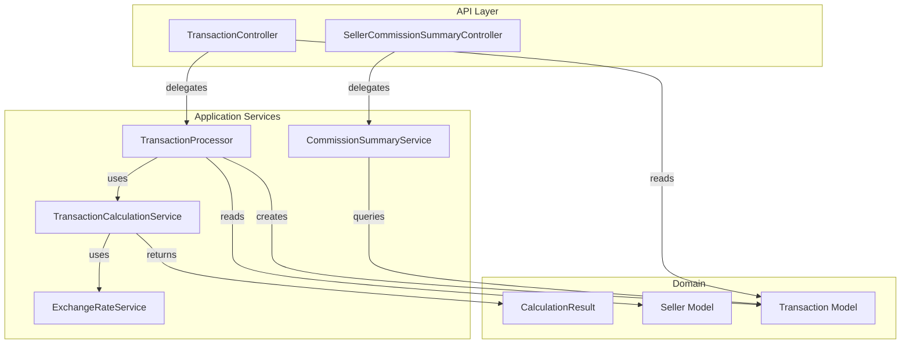
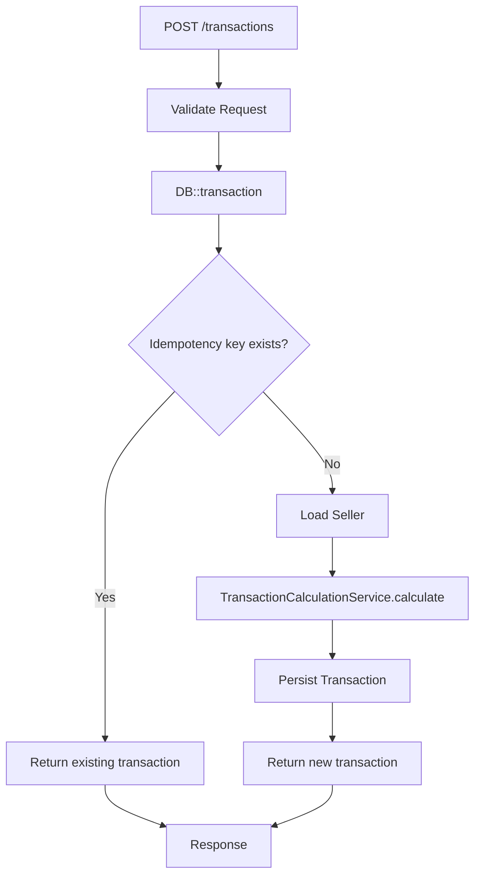
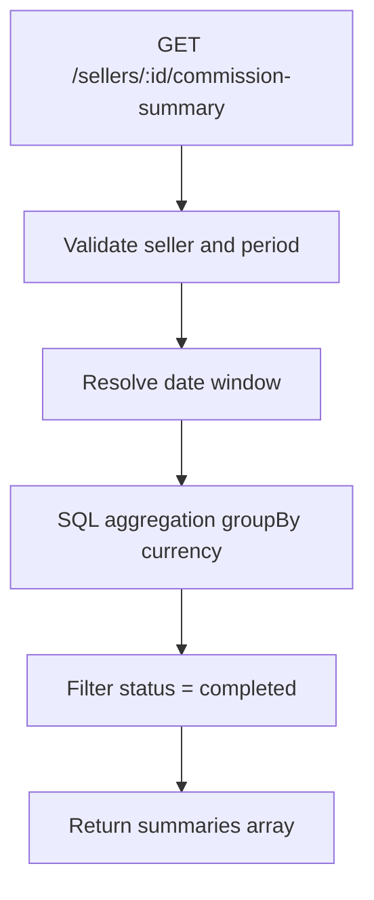

# Payment Commission Calculator — Implementation Overview

## Overview

This document describes my implementation of the Payment Commission Calculator. 

The solution provides a REST API with three endpoints that process transactions, calculate provider fees and Tebex commission with cent-level precision, support idempotent transaction creation, and return seller commission summaries grouped by currency.

---

## Architecture




## Running the Tests

```bash
php artisan test
```

---

## Demo Data

The [DatabaseSeeder](database/seeders/DatabaseSeeder.php) populates sample sellers and transactions for quick testing

Run `php artisan migrate --seed` to load this data. The section below uses these IDs in its curl examples.

---

## Try the API

With the server running (`php artisan serve`), you can try the endpoints:

**Process a transaction:**

```bash
curl -X POST http://localhost:8000/api/v1/transactions \
  -H "Content-Type: application/json" \
  -d '{
    "seller_id": "seller_pro",
    "amount": 10000,
    "currency": "USD",
    "payment_provider": "stripe",
    "customer_id": "cust_456",
    "idempotency_key": "unique-key-123"
  }'
```

**Get a transaction:**

```bash
curl http://localhost:8000/api/v1/transactions/txn_demo_001
```

**Get seller commission summary:**

```bash
curl "http://localhost:8000/api/v1/sellers/seller_pro/commission-summary?period=monthly"
```

---

## Feature Flows

### Transaction Processing Flow




### Commission Summary Flow




---


| Layer                  | Files                                                                                                                                                                                                                                                                                                                                                                                                                                                          |
| ---------------------- | -------------------------------------------------------------------------------------------------------------------------------------------------------------------------------------------------------------------------------------------------------------------------------------------------------------------------------------------------------------------------------------------------------------------------------------------------------------- |
| **Controllers**        | [app/Http/Controllers/TransactionController.php](app/Http/Controllers/TransactionController.php), [app/Http/Controllers/SellerCommissionSummaryController.php](app/Http/Controllers/SellerCommissionSummaryController.php)                                                                                                                                                                                                                                     |
| **Services**           | [app/Services/Transactions/TransactionProcessor.php](app/Services/Transactions/TransactionProcessor.php), [app/Services/Transactions/TransactionCalculationService.php](app/Services/Transactions/TransactionCalculationService.php), [app/Services/Transactions/CommissionSummaryService.php](app/Services/Transactions/CommissionSummaryService.php), [app/Services/Transactions/ExchangeRateService.php](app/Services/Transactions/ExchangeRateService.php) |
| **Value Objects**      | [app/ValueObjects/CalculationResult.php](app/ValueObjects/CalculationResult.php)                                                                                                                                                                                                                                                                                                                                                                               |
| **Models**             | [app/Models/Seller.php](app/Models/Seller.php), [app/Models/Transaction.php](app/Models/Transaction.php)                                                                                                                                                                                                                                                                                                                                                       |
| **Requests/Resources** | [app/Http/Requests/StoreTransactionRequest.php](app/Http/Requests/StoreTransactionRequest.php), [app/Http/Resources/TransactionResource.php](app/Http/Resources/TransactionResource.php), [app/Http/Resources/CommissionSummaryResource.php](app/Http/Resources/CommissionSummaryResource.php)                                                                                                                                                                 |
| **Migrations**         | [database/migrations/2026_03_04_101453_create_sellers_table.php](database/migrations/2026_03_04_101453_create_sellers_table.php), [database/migrations/2026_03_04_101685_create_transactions_table.php](database/migrations/2026_03_04_101685_create_transactions_table.php)                                                                                                                                                                                   |
| **Seeders**            | [database/seeders/DatabaseSeeder.php](database/seeders/DatabaseSeeder.php)                                                                                                                                                                                                                                                                                                                                                                                     |
| **Tests**              | [tests/Unit/TransactionCalculationServiceTest.php](tests/Unit/TransactionCalculationServiceTest.php), [tests/Unit/ExchangeRateServiceTest.php](tests/Unit/ExchangeRateServiceTest.php), [tests/Unit/CalculationResultTest.php](tests/Unit/CalculationResultTest.php), [tests/Feature/TransactionApiTest.php](tests/Feature/TransactionApiTest.php)                                                                                                             |
| **Routes**             | [routes/api.php](routes/api.php)                                                                                                                                                                                                                                                                                                                                                                                                                               |


---

## Exception Handling

Services may throw `InvalidArgumentException` for invalid input (unsupported currency, payment provider, seller tier, or period). These are mapped to HTTP 422 responses in [bootstrap/app.php](bootstrap/app.php) so API consumers receive validation-style errors instead of 500:

```json
{
  "message": "Unsupported payment provider."
}
```

---

## Commission Summary Endpoint Design

### Why the response format differs from the README example

The README example shows a single-object response:

```json
{
  "seller_id": "seller_123",
  "period": "2024-01",
  "total_transactions": 150,
  "total_gross_amount": 1500000,
  "total_commission": 105000,
  "total_net_amount": 1395000,
  "currency": "USD"
}
```

The implementation returns a **per-currency summaries array** instead:

```json
{
  "seller_id": "seller_123",
  "period": "monthly",
  "start_at": "2024-01-01T00:00:00+00:00",
  "end_at": "2024-01-31T23:59:59+00:00",
  "summaries": [
    {
      "currency": "USD",
      "total_transactions": 100,
      "total_gross_amount": 1000000,
      "total_commission": 70000,
      "total_net_amount": 930000
    },
    {
      "currency": "EUR",
      "total_transactions": 50,
      "total_gross_amount": 500000,
      "total_commission": 35000,
      "total_net_amount": 465000
    }
  ]
}
```

### Rationale

If a seller has transactions in multiple currencies (USD, EUR, GBP). A single-currency summary would require converting all amounts to one currency, which introduces exchange-rate assumptions and loses per-currency clarity. Returning separate summaries per currency avoids arbitrary conversion, preserves accuracy, and gives sellers a clear breakdown by currency.